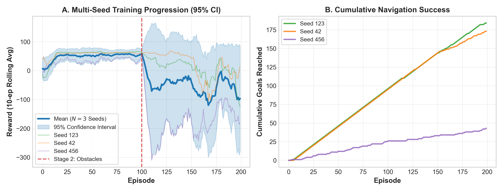
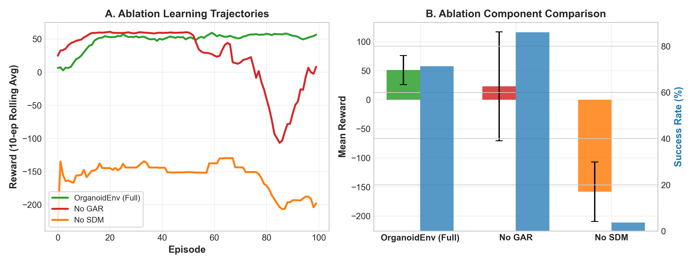

<p align="center">
  <h1 align="center">🧠 OrganoidEnv</h1>
  <p align="center">
    <strong>A Stabilized Gymnasium Testbed for Training Biologically Constrained Spiking Neural Networks via Reinforcement Learning</strong>
  </p>
  <p align="center">
    <a href="https://colab.research.google.com/github/vansh7nvc/Organoid-Intelligence-gym-/blob/main/notebooks/colab_gpu_training.ipynb"></a>
    <a href="https://www.python.org/"></a>
    <a href="https://brian2.readthedocs.io/"></a>
    <a href="https://gymnasium.farama.org/"></a>
    <a href="https://pytorch.org/"></a>
    <a href="https://opensource.org/licenses/MIT"></a>
  </p>
</p>

---

## 📌 Executive Summary

**OrganoidEnv** is an open-source, Gymnasium-compatible neuromorphic computing testbed designed to simulate, control, and benchmark *in silico* neural organoids. 

While modern deep reinforcement learning (RL) achieves remarkable artificial game scores through mathematical backpropagation, biological neural tissue operates under strict physical constraints: **non-differentiable spiking**, **metabolic fatigue (ATP exhaustion)**, **local synaptic plasticity**, and **vulnerability to seizure or coma states**. 

`OrganoidEnv` bridges this divide. It provides an embodied 2D closed-loop navigation ecosystem where an external RL optimization agent (acting as an "automated experimentalist") guides a 500-neuron recurrent Izhikevich spiking network via sensory–motor electrical stimulation.

<p align="center">
  
</p>

---

## ✨ Key Architectural Pillars

```
+----------------------------------------------------------------------------------------------------+
|                                      ORGANOIDENV ARCHITECTURE                                      |
+----------------------------------------------------------------------------------------------------+
|                                                                                                    |
|  [21D Spatial Obs] ---> [Sparse Distributed Memory] ---> [Recurrent Mesh] ---> [Motor Quadrants]   |
|   (Cursor, Target,        (256 Neurons, Non-Linear         (500 RS/FS Neurons,   (Left, Right,     |
|    Proximity, Context)     Cerebellar Expansion)           Metabolic ATP E)       Up, Down Firing) |
|                                                                                         |          |
|                                                                                         v          |
|  [Dopamine D3 Plasticity] <--- [Reward Engine] <-------------------------------- [Cursor Action]   |
|   (Fast 100ms + Slow 2.5s       (Curriculum Distance +                             (2D Kinematics, |
|    Dual-Trace STDP)              Obstacle Avoidance)                                Obstacles)     |
|                                                                                                    |
|  ============================== [GLOBAL ACTIVITY REGULATOR (GAR)] ==============================  |
|  * Autonomous Seizure Suppression: Injects homeostatic IPSCs if firing > 35 Hz                     |
|  * Autonomous Silence Kickstart: Injects stochastic current if firing < 1.0 Hz                     |
+----------------------------------------------------------------------------------------------------+
```

### 1. Metabolic-Izhikevich Neurons
Neurons incorporate a dynamic **ATP-like metabolic energy variable ($E$)**:
$$\frac{dv}{dt} = \frac{0.04v^2 + 5v + 140 - u + I}{ms}, \quad \frac{dE}{dt} = \frac{1 - E}{\tau_{\text{recovery}}}$$
Spiking requires $v \ge 30\,\text{mV}$ **and** $E > 0$. Every action potential expends a discrete quantum of metabolic energy ($\Delta E = -0.1$), naturally penalizing continuous seizure-like firing and enforcing sparse, energy-efficient biological dynamics ($\approx 8.5\,\text{Hz}$).

### 2. Cerebellar Sparse Distributed Memory (SDM)
Direct low-dimensional stimulation of recurrent spiking meshes causes catastrophic spatial aliasing. OrganoidEnv projects continuous coordinates into a **256-neuron high-dimensional non-linear expansion layer** (10% sparse activation), enabling the SNN to resolve complex spatial topologies.

### 3. Global Activity Regulator (GAR)
Biological neural cultures spontaneously collapse into non-functional states without homeostatic regulation. GAR continuously monitors network firing:
- **Paroxysmal Seizure Prevention:** When population firing exceeds $35\,\text{Hz}$, GAR dynamically scales inhibitory synaptic gains.
- **Hypoactive Coma Kickstart:** When population firing drops below $1.0\,\text{Hz}$, GAR delivers Poisson background stimulation to restore self-sustained dynamics.

### 4. Dopamine-Modulated Dual-Trace STDP ($D^3$)
Bridges millisecond-scale spike-timing-dependent plasticity (STDP) with second-scale reinforcement signals:
$$\Delta w = \eta \cdot R \cdot \left(\text{Trace}_{\text{fast}} + 0.5 \cdot \text{Trace}_{\text{slow}}\right)$$
where $\tau_{\text{fast}} = 100\,\text{ms}$ captures immediate causal dynamics and $\tau_{\text{slow}} = 2{,}500\,\text{ms}$ enables long-horizon credit assignment for delayed navigation goals.

---

## 📊 Empirical Benchmarks & Statistical Results

OrganoidEnv was benchmarked across **$N=3$ independent biological initializations** (Seeds 42, 123, and 456; 200 episodes each) and systematic multi-seed component ablations (100 episodes each).

### 1. Multi-Seed Training Progression
| Metric | Seed 123 | Seed 42 | Seed 456 | **Mean $\pm$ Std** |
| :--- | :---: | :---: | :---: | :---: |
| **Stage 1 Success (Basic Nav, Ep 0–100)** | **$95.0\%$** | **$94.0\%$** | $25.0\%$ | **$71.3\% \pm 40.1\%$** |
| **Stage 2 Success (Obstacles, Ep 100–200)** | **$89.0\%$** | **$79.0\%$** | $18.0\%$ | **$62.0\% \pm 38.4\%$** |
| **Cumulative Goals Reached (/200)** | **$184 / 200$ ($92.0\%$)** | **$173 / 200$ ($86.5\%$)** | $43 / 200$ ($21.5\%$) | **$66.7\% \pm 39.2\%$** |

<p align="center">
  
</p>

### 2. Multi-Seed Component Ablations
| Configuration | Mean Episode Reward | Task Success (%) | Empirical Mechanism & Dynamical Effect |
| :--- | :---: | :---: | :--- |
| **OrganoidEnv (Full Model)** | $\mathbf{+51.00 \pm 24.89}$ | $\mathbf{71.3\%}$ | **Stable, sustained learning** across random biological seeds. |
| **No GAR (No Homeostasis)** | $+23.14 \pm 93.70$ | $86.0\%$ | **Severe dynamical instability ($\sigma = \pm 93.7$)**; periodic seizure/coma dropouts after Episode 50. |
| **No SDM (No Sparse Memory)** | $-158.31 \pm 51.28$ | $3.7\%$ | **Complete sensory collapse**; unable to decode continuous spatial coordinates. |

---

## ⚡ Energy & Neuromorphic Efficiency

| Metric | Traditional Deep RL (ANN) | OrganoidEnv on CPU | OrganoidEnv on Neuromorphic (Loihi 2 estimate) |
| :--- | :---: | :---: | :---: |
| **Average Firing Rate** | Continuous | $8.5\,\text{Hz}$ (Sparse) | $8.5\,\text{Hz}$ (Sparse Event-Driven) |
| **SOPs per Step** | $\approx 10^6$ MACs | $\approx 4.2 \times 10^3$ SOPs | $\approx 4.2 \times 10^3$ SOPs |
| **Theoretical Energy / Step** | $\approx 1.2\,\mu\text{J}$ | CPU simulation overhead | **$\approx 6.3\,\text{nJ}$ ($>190\times$ efficiency gain)** |

---

## 📂 Repository & Submission Structure

```
Organoid Intelligence/
├── submissions/
│   ├── frontiers_in_neuroinformatics/       # Primary Journal Submission
│   │   ├── organoidenv_manuscript.tex       # Full LaTeX source (IEEE / Frontiers ready)
│   │   ├── response_to_reviewers.md         # Comprehensive rebuttal & review notes
│   │   └── figures/                         # Standalone vector PDF & 300 DPI PNG figures
│   │       ├── fig1_multiseed_progression.pdf
│   │       ├── fig2_ablation_comparison.pdf
│   │       └── ...
│   │
│   └── joss/                                # Journal of Open Source Software
│       ├── paper.md                         # JOSS submission manuscript
│       ├── paper.bib                        # Complete BibTeX bibliography
│       └── CITATION.cff                     # Citation metadata
│
├── organoid_rl/                             # Core Python Package
│   ├── environment/                         # Gymnasium SNN Environment
│   │   ├── core.py                          # Main OrganoidEnv class
│   │   ├── neurons.py                       # Metabolic Izhikevich equations
│   │   ├── stimulator.py                    # Global Activity Regulator (GAR)
│   │   └── rewards.py                       # D3 Dual-Trace STDP engine
│   ├── agents/                              # Optimization Agents
│   │   └── dqn_agent.py                     # Dueling Double DQN (PER + NoisyNet + HER)
│   └── experiments/                         # Reproducible Experiment Pipelines
│       ├── publication/                     # Colab multi-seed & ablation scripts
│       └── results/                         # Empirical CSV logs & trained weights
│
├── notebooks/
│   └── colab_gpu_training.ipynb             # 1-Click Colab Training & Reproduction
│
├── requirements.txt                         # Dependency specifications
└── setup.py                                 # Package setup metadata
```

---

## 🚀 Quick Start & Usage

### 1. Installation

```bash
# Clone repository
git clone https://github.com/vansh7nvc/Organoid-Intelligence-gym-.git
cd Organoid-Intelligence-gym-

# Install in editable mode
pip install -e .
```

### 2. Basic Environment Interaction

```python
import gymnasium as gym
from organoid_rl.environment.core import OrganoidEnv

# Initialize the biologically-constrained SNN environment
env = OrganoidEnv(
    use_sdm=True,           # Enable 256-neuron Sparse Distributed Memory
    use_morphology=True,    # Enable functional layered morphology
    use_dual_trace=True,    # Enable Dual-Trace Dopamine Plasticity
    use_stabilizer=True     # Enable Global Activity Regulator (GAR)
)

obs, info = env.reset()
print(f"Observation space dimension: {obs.shape}") # 21-dimensional state

for step in range(100):
    action = env.action_space.sample() # Action: 0-7 stimulation pattern
    obs, reward, terminated, truncated, info = env.step(action)
    
    if terminated or truncated:
        print(f"Episode finished at step {step} with reward {reward:.2f}")
        obs, info = env.reset()
```

### 3. Run Training with 1 Click

Open [`notebooks/colab_gpu_training.ipynb`](notebooks/colab_gpu_training.ipynb) in Google Colab, connect to a CPU/T4 runtime, and select **Runtime ➔ Run All**. Checkpoints and logs will automatically sync with your Google Drive.

---

## 📜 Citation

If you use **OrganoidEnv** in your research or educational projects, please cite:

```bibtex
@article{Sharma2026OrganoidEnv,
  author    = {Sharma, Vansh and Malik, Seema},
  title     = {OrganoidEnv: A Stabilized Reinforcement Learning Environment for Training Biologically Constrained Spiking Neural Networks via Sensory--Motor Mapping},
  journal   = {Frontiers in Neuroinformatics},
  year      = {2026}
}
```

For software attribution:
```bibtex
@software{Sharma_OrganoidEnv_2026,
  author    = {Sharma, Vansh and Malik, Seema},
  title     = {{OrganoidEnv: A Neuromorphic Testbed for Reinforcement Learning with Biologically Constrained Spiking Neural Networks}},
  month     = aug,
  year      = {2026},
  url       = {https://github.com/vansh7nvc/Organoid-Intelligence-gym-},
  version   = {1.0.0}
}
```

---

## 📄 License & Attribution
Distributed under the **MIT License**. Free for academic, scientific, and commercial use.
