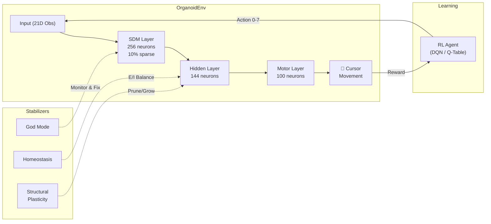

<p align="center">
  <h1 align="center">🧠 OrganoidEnv</h1>
  <p align="center">
    <em>A Stabilized Reinforcement Learning Environment for Biological Spiking Networks</em>
  </p>
  <p align="center">
    
    
    
    
    
  </p>
</p>

---

**OrganoidEnv** is a Gymnasium-compatible reinforcement learning environment that wraps a biologically-realistic spiking neural network built with [Brian2](https://brian2.readthedocs.io/). The "organoid" learns to navigate a 2D space with obstacles by modulating its own neural activity — no gradient descent involved.

## ✨ Key Features

| Feature | Description |
|:--|:--|
| **Metabolic Izhikevich Neurons** | Energy-gated spiking model with ATP recovery dynamics |
| **Sparse Distributed Memory** | Cerebellum-like 256-neuron expansion layer for state encoding |
| **Clustered Motor Output** | Quadrant-based motor neurons (Up/Down/Left/Right) |
| **Dopamine D3 Learning Rule** | Dual-trace eligibility (fast 100ms + slow 2500ms) with reward modulation |
| **God Mode Stabilizer** | Automatic seizure suppression and activity kickstart |
| **Curriculum Learning** | 4-stage difficulty ramp (easy → obstacles → multi-goal → full) |
| **Structural Plasticity** | Synapse pruning for weak connections |
| **Dueling Double DQN** | PER, Noisy Nets, N-step returns, and HER for the outer agent |

## 🏗️ Architecture



## 🚀 Quick Start

### Installation

```bash
git clone https://github.com/vansh-sharma/organoid-rl.git
cd organoid-rl
pip install -e .
```

Or with Docker:

```bash
docker build -t organoid-rl .
docker run organoid-rl
```

### Run a Quick Test

```bash
# Verify Brian2 works
python sanity_check.py

# Watch the organoid navigate (80 steps)
python ../diagnostic_cursor.py
```

### Training

```bash
# Month 3: Basic cursor navigation (Q-Learning)
python experiments/07_month3_training.py

# Month 4: SDM + Obstacles + Ablation study
python experiments/09_month4_training.py
python experiments/10_month4_ablation_study.py

# Month 5: Multi-goal navigation with context switching
python experiments/11_month5_multigoal_training.py

# Month 6: Grand Unification (Dueling DDQN + Curriculum + HER)
python experiments/12_month6_training.py
```

## 📊 Results Summary

| Phase | Agent | Key Milestone | Episodes |
|:--|:--|:--|--:|
| Month 1 | — | Stable 500-neuron spiking network (5-10 Hz) | — |
| Month 2 | Random | Pavlov conditioning: Bell → Saliva pathway | 50 |
| Month 3 | Q-Table | First cursor-to-goal navigation | 150 |
| Month 4 | Q-Table | SDM + Obstacles + Ablation proof | 100 |
| Month 5 | Q-Table | Multi-goal with context switching | 250 |
| Month 6 | Dueling DDQN | Curriculum stage 1-4, HER, structural plasticity | 500 |

## 📁 Project Structure

```
organoid-rl/
├── environment/
│   ├── core.py          # OrganoidEnv (Gymnasium wrapper)
│   ├── neurons.py       # Metabolic Izhikevich model
│   ├── stimulator.py    # God Mode stabilizer
│   └── rewards.py       # D3 dopamine learning rule
├── agents/
│   └── dqn_agent.py     # Dueling Double DQN + PER + HER
├── experiments/
│   ├── 01-06_*          # Foundation tests (Month 1)
│   ├── 07_month3_*      # Cursor navigation training
│   ├── 08-10_month4_*   # SDM, obstacles, ablation
│   ├── 11_month5_*      # Multi-goal training
│   ├── 12_month6_*      # Grand Unification training
│   └── 13_generate_*    # Publication figure generator
├── reports/             # Monthly progress reports
├── setup.py
├── requirements.txt
├── Dockerfile
└── LICENSE              # MIT
```

## 🔬 How It Works

1. **The Organoid**: 500 Metabolic-Izhikevich neurons connected via STDP synapses with energy-gated firing.
2. **The Task**: Navigate a virtual cursor from `(0.1, 0.9)` to target `(0.8, 0.8)` while avoiding obstacles.
3. **The Agent**: Stimulates specific neuron groups (actions 0-7). The organoid's motor neuron clusters translate spiking activity into cursor movement.
4. **The Learning**: Reward signals modulate synapse weights through eligibility traces — recent pre-synaptic activity gets credit for good outcomes.

## 📄 Citation

```bibtex
@software{sharma2026organoidenv,
  title  = {OrganoidEnv: A Stabilized Reinforcement Learning Environment 
            for Biological Spiking Networks},
  author = {Sharma, Vansh},
  year   = {2026},
  url    = {https://github.com/vansh-sharma/organoid-rl},
}
```

## 📜 License

This project is licensed under the MIT License — see [LICENSE](LICENSE) for details.
